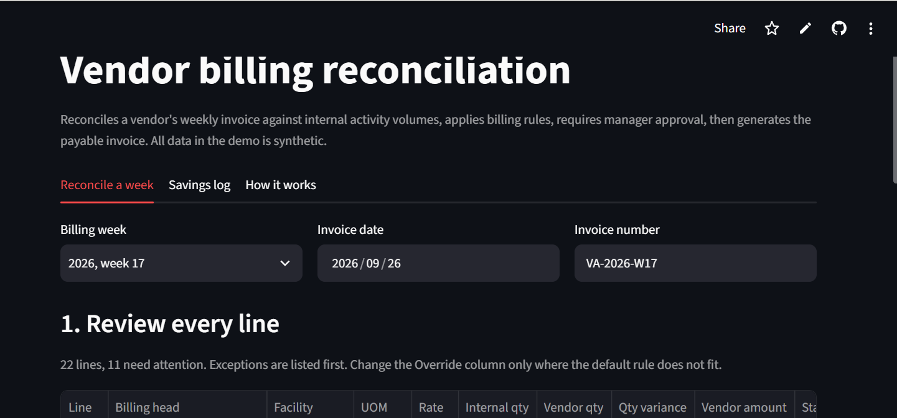
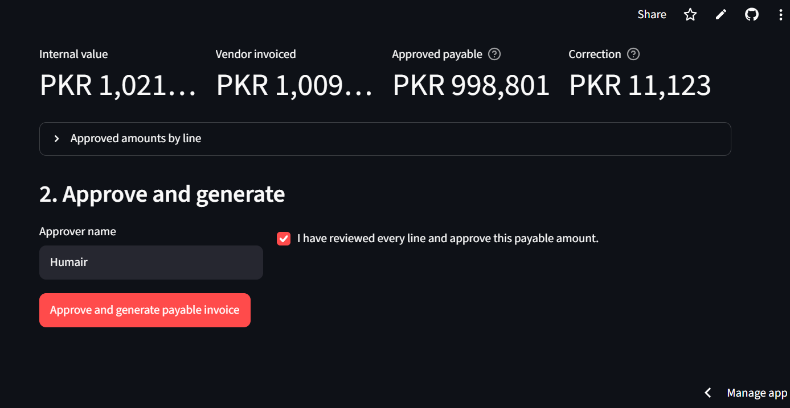
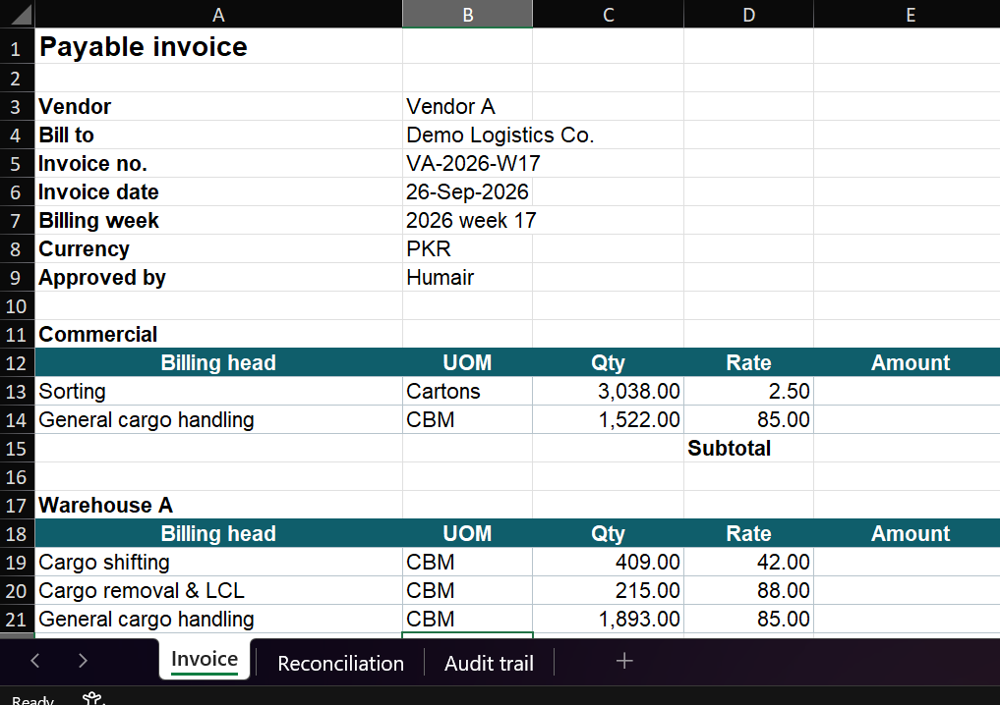
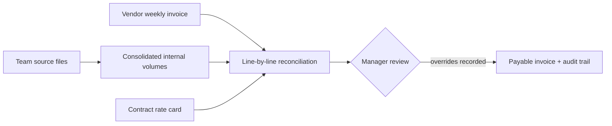

# Vendor Billing Reconciliation

**Live demo:** https://vendor-billing-reconciliation.streamlit.app/

A Streamlit app that reconciles a vendor's weekly invoice against internal activity volumes, applies billing rules line by line, requires a named manager's approval, and generates the payable invoice in Excel with a full audit trail.

> Demo built on **synthetic data**. It recreates the approach of a production workflow I built for warehouse vendor billing, where the same method cut invoice preparation from days of manual Excel work to 5–10 minutes. No company code, data, names or rates are included.

## Screenshots





## The problem

Weekly vendor billing depended on 6–7 files from different teams, each in a different format. Someone had to cross-check every invoice line against internal records in Excel. It took hours to days per cycle, and overbilling slipped through.

## How it works



| Situation | Default action | Why |
|---|---|---|
| Vendor quantity above internal records | Pay the internal quantity | The vendor billed more work than was recorded |
| Vendor quantity below internal records | Pay the vendor's quantity | The vendor billed less; pay what was invoiced |
| Quantities match | Pay as invoiced | No difference |
| Vendor amount ≠ quantity × contract rate | Contract rate applied | Protects against rate drift |
| Manager override | Force internal or vendor quantity for a line | Handles cases the rules cannot see |

**Payable = approved quantity × contract rate.** Automation prepares the numbers; a person approves them. No invoice is generated until the approver confirms the review, and every override is written to the invoice file's audit trail.

## Features

- Line-by-line comparison by billing head and facility, with exceptions listed first
- Rate check against the contract rate card
- Manager override per line, captured in the audit trail
- Approval gate: nothing is generated without a named approver
- Excel output with three sheets: formatted invoice (live formulas), full reconciliation, and audit trail
- Savings log across all weeks: vendor invoiced vs approved payable vs correction

## Run it locally

```bash
pip install -r requirements.txt
streamlit run app.py
```

On Windows, double-click `run_app.bat`.

The app opens with sample data. To use your own files, choose **Upload CSV files** in the sidebar.

## Input files

| File | Columns |
|---|---|
| `internal_volumes.csv` | year, week, facility, billing_head, qty |
| `vendor_invoice.csv` | year, week, invoice_no, facility, billing_head, qty, amount |
| `rate_card.csv` | billing_head, uom, rate |

Regenerate the sample data with `python generate_data.py`. It creates 8 weeks of activity and a vendor invoice with deliberate overbilling, underbilling, missing lines and rate errors.

## Project structure
